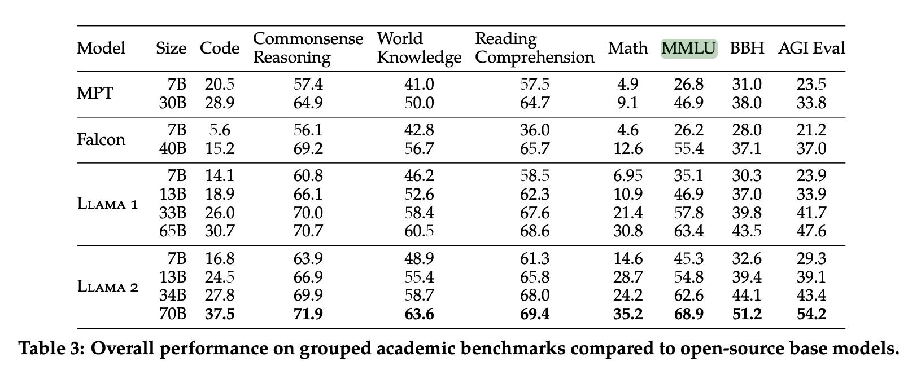
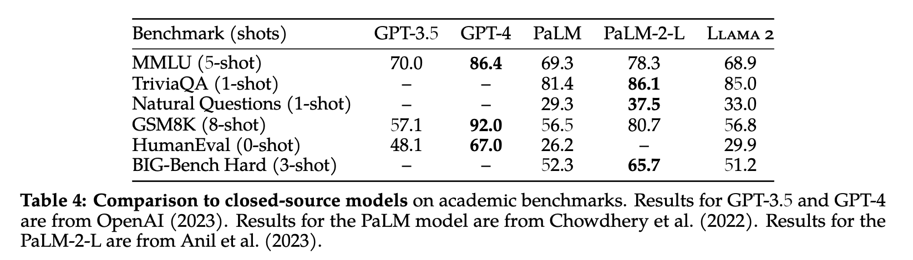
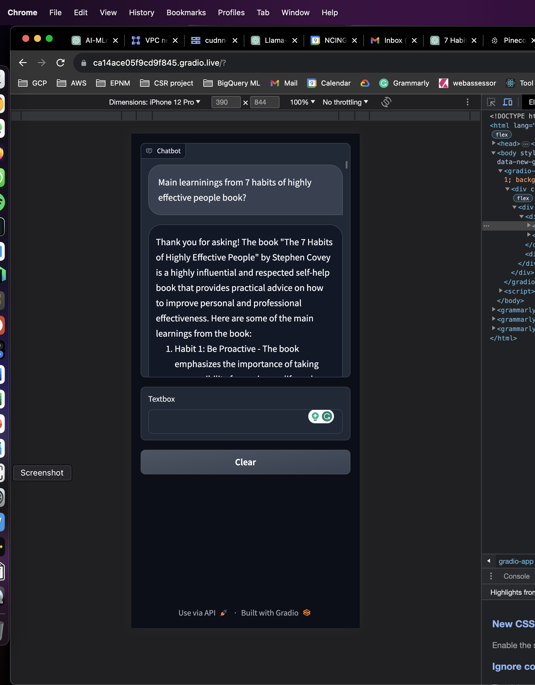
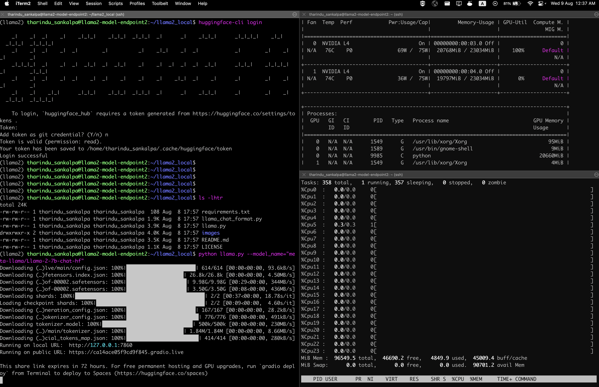

# **Llama Models - An Overview**

The Llama models, developed by MetaAI, are a series of breakthroughs in open-source AI. 
The Llama 2 model is a standout in the AI world, primarily because it's open-source. 
This means anyone can access and utilize its capabilities freely, fostering innovation and broader application. 
More crucially, its open-source nature addresses pressing data privacy concerns. 
Users can run Llama 2 locally, ensuring their data remains in their control and sidestepping the privacy issues tied to many commercial models.
While many are familiar with renowned models like GPT-3.5 and Google's Palm, the Llama2-70B stands out not just for its competitive performance - verified through [research paper](https://ai.meta.com/research/publications/llama-2-open-foundation-and-fine-tuned-chat-models/) and human evaluations - but also for its open-source nature.
Here's what you need to know:

## **Llama 2 Enhancements:**

- **Context Size:** Doubled from 2048 to 4096 tokens, enabling more in-depth content processing.
- **Training:** Improved with 40% more tokens, leading to better performance on benchmarks.
- **Commercial Use:** Llama 2 is available for commercial applications, broadening its accessibility.
- **Llama2 Chat:** A fine-tuned chat version, assessed to be more helpful in responses than existing models like ChatGPT.

## **Future Potential:**

Graphs of the model's performance indicate that larger models, especially the 70 billion parameter variant, could still improve with more training and tokens. Even the smaller 7 billion parameter model shows strong performance, though closer to its peak.

## **Comparison with ChatGPT:**

Llama2 Chat has been evaluated to provide more helpful answers compared to ChatGPT. It's a free model that can be utilized for various purposes, including commercial ones.

In a nutshell, Llama 2 is an innovative AI model that offers advancements in context understanding, training efficiency, and practical applications. It marks a significant step forward in the field and offers exciting possibilities for developers and businesses.

# **Llama 2 Model Overview**

## **Capabilities and Features**:

1. **Commercial Use**: The Llama 2 model is available for commercial purposes unless you're a business with over 700 million monthly active users. In which case, there might be restrictions or licensing requirements.
2. **Comparison with Industry Leaders**: In benchmarks, Llama 2 has shown performance that, while not quite on par with proprietary models like GPT-4 and Palm 2L, is competitive especially considering its open-source nature.
    - In the MMLU benchmark, Llama 2 scored 68, which is between the scores of GPT-4 (86) and GPT-3. For context, the MMLU benchmark assesses performance on a wide range of tasks. 
      
3. **Position among Open-Source Models:** When compared to other open-source models, Llama 2 stands out as a leading performer, especially on the MMLU benchmark. This suggests that, among freely available models, Llama 2 offers the most advanced capabilities currently available.
      
4. **Coding Capability:** One exception to Llama 2's top-tier performance is in coding tasks, where the MPT model, another open-source contender, outperforms it in the 7 billion parameter category.

## **Significance**:

The release of the Llama 2 model democratizes access to powerful AI. Companies and individual developers alike can harness advanced machine learning capabilities without incurring the high costs associated with using proprietary models from big players in the AI industry.

# **🚀 Setting Up Llama2-7B on Google Cloud VM with NVIDIA**

This guide will help you to set up Llama-7B on your Google Cloud VM equipped with NVIDIA GPUs.

### **Prerequisites:**

- Google Cloud VM: 24vCPU, 96 RAM, and 2*NVIDAN L4s (24Gb VRAM x 2)

### **1. Initial System Setup**

```bash

sudo su -
passwd
passwd tharindu_sankalpa
usermod -a -G sudo,adm tharindu_sankalpa

```

### **2. SSH Configuration**

```bash

vi /etc/ssh/sshd_config
systemctl restart sshd

```

After making changes to the SSH configuration, connect to the server:

```bash

ssh tharindu_sankalpa@YOUR_VM_IP_ADDRESS

```

### **3. System Update**

```bash

sudo apt-get update
sudo apt-get upgrade

```

### **4. Install NVIDIA Driver**

Check current NVIDIA status:

```bash

nvidia-smi

```
Output should be something like this.


```bash

tharindu_sankalpa@llama2-model-endpoint2:~$ nvidia-smi
Tue Aug  8 16:45:14 2023
+-----------------------------------------------------------------------------+
| NVIDIA-SMI 525.125.06   Driver Version: 525.125.06   CUDA Version: 12.0     |
|-------------------------------+----------------------+----------------------+
| GPU  Name        Persistence-M| Bus-Id        Disp.A | Volatile Uncorr. ECC |
| Fan  Temp  Perf  Pwr:Usage/Cap|         Memory-Usage | GPU-Util  Compute M. |
|                               |                      |               MIG M. |
|===============================+======================+======================|
|   0  NVIDIA L4           Off  | 00000000:00:03.0 Off |                    0 |
| N/A   61C    P8    19W /  72W |     70MiB / 23034MiB |      0%      Default |
|                               |                      |                  N/A |
+-------------------------------+----------------------+----------------------+
|   1  NVIDIA L4           Off  | 00000000:00:04.0 Off |                    0 |
| N/A   61C    P8    19W /  72W |      4MiB / 23034MiB |      0%      Default |
|                               |                      |                  N/A |
+-------------------------------+----------------------+----------------------+

+-----------------------------------------------------------------------------+
| Processes:                                                                  |
|  GPU   GI   CI        PID   Type   Process name                  GPU Memory |
|        ID   ID                                                   Usage      |
|=============================================================================|
|    0   N/A  N/A      1531      G   /usr/lib/xorg/Xorg                 59MiB |
|    0   N/A  N/A      1590      G   /usr/bin/gnome-shell               10MiB |
|    1   N/A  N/A      1531      G   /usr/lib/xorg/Xorg                  4MiB |
+-----------------------------------------------------------------------------+
tharindu_sankalpa@llama2-model-endpoint2:~$
tharindu_sankalpa@llama2-model-endpoint2:~$

```

Install the NVIDIA driver:

```bash

sudo apt-get install nvidia-driver-525
sudo reboot now

```

Once the system is rebooted, check your VM's availability:

```bash

ping YOUR_VM_IP_ADDRESS
ssh tharindu_sankalpa@YOUR_VM_IP_ADDRESS

```

### **5. Install CUDA Toolkit**

Fetch and configure CUDA:

```bash

wget https://developer.download.nvidia.com/compute/cuda/repos/ubuntu2004/x86_64/cuda-ubuntu2004.pin
sudo mv cuda-ubuntu2004.pin /etc/apt/preferences.d/cuda-repository-pin-600
wget https://developer.download.nvidia.com/compute/cuda/12.1.0/local_installers/cuda-repo-ubuntu2004-12-1-local_12.1.0-530.30.02-1_amd64.deb
sudo dpkg -i cuda-repo-ubuntu2004-12-1-local_12.1.0-530.30.02-1_amd64.deb
sudo cp /var/cuda-repo-ubuntu2004-12-1-local/cuda-*-keyring.gpg /usr/share/keyrings/
sudo apt-get update
sudo apt-get -y install cuda

```

Reboot the VM:

```bash

sudo reboot now

```

### **6. Install Miniconda & Setup TensorFlow Environment**

```bash

wget https://repo.anaconda.com/miniconda/Miniconda3-py39_23.5.2-0-Linux-x86_64.sh
chmod +x Miniconda3-py39_23.5.2-0-Linux-x86_64.sh
./Miniconda3-py39_23.5.2-0-Linux-x86_64.sh
source .bashrc
conda create --name tf_gpu_env python=3.9.13
conda activate tf_gpu_env
pip install tensorflow

```

Verify CUDA compiler version:

```bash

nvcc --version
sudo apt install nvidia-cuda-toolkit

```

### **7. Install cuDNN**

```bash

wget https://storage.googleapis.com/windows-server-imaage-bucket/cudnn-11.3-linux-x64-v8.2.1.32.tgz
tar -xzvf cudnn-11.3-linux-x64-v8.2.1.32.tgz
sudo cp -P cuda/include/cudnn*.h /usr/local/cuda/include/
sudo cp -P cuda/lib64/libcudnn* /usr/local/cuda/lib64/
sudo chmod a+r /usr/local/cuda/include/cudnn*.h /usr/local/cuda/lib64/libcudnn*

```

Then, adjust the environment and libraries:

```bash

conda install -c conda-forge cudatoolkit=11.8.0
pip install nvidia-cudnn-cu11==8.6.0.163

mkdir -p $CONDA_PREFIX/etc/conda/activate.d
echo 'CUDNN_PATH=$(dirname $(python -c "import nvidia.cudnn;print(nvidia.cudnn.__file__)"))' >> $CONDA_PREFIX/etc/conda/activate.d/env_vars.sh
echo 'export LD_LIBRARY_PATH=$CONDA_PREFIX/lib/:$CUDNN_PATH/lib:$LD_LIBRARY_PATH' >> $CONDA_PREFIX/etc/conda/activate.d/env_vars.sh

```

Test TensorFlow and GPU:

```bash

python3 -c "import tensorflow as tf; print(tf.reduce_sum(tf.random.normal([1000, 1000])))"
python3 -c "import tensorflow as tf; print(tf.config.list_physical_devices('GPU'))"

```

### **8. Setting Up Llama2**

```bash

conda create -n llama2 python=3.9
conda activate llama2
git clone https://github.com/thisserand/llama2_local.git
cd llama2_local/
pip install -r requirements.txt

huggingface-cli login
# Follow on-screen prompts to enter your Hugging Face token
```

### **9. Run Llama:**

```bash
python llama.py --model_name="meta-llama/Llama-2-7b-chat-hf"

(llama2) tharindu_sankalpa@llama2-model-endpoint2:~/llama2_local$ python llama.py --model_name="meta-llama/Llama-2-7b-chat-hf"
Downloading (…)lve/main/config.json: 100%|███████████████████████| 614/614 [00:00<00:00, 93.6kB/s]
Downloading (…)fetensors.index.json: 100%|███████████████████| 26.8k/26.8k [00:00<00:00, 4.50MB/s]
Downloading (…)of-00002.safetensors: 100%|████████████████████| 9.98G/9.98G [00:29<00:00, 344MB/s]
Downloading (…)of-00002.safetensors: 100%|████████████████████| 3.50G/3.50G [00:08<00:00, 436MB/s]
Downloading shards: 100%|███████████████████████████████████████████| 2/2 [00:37<00:00, 18.78s/it]
Loading checkpoint shards: 100%|████████████████████████████████████| 2/2 [00:09<00:00,  4.60s/it]
Downloading (…)neration_config.json: 100%|███████████████████████| 167/167 [00:00<00:00, 28.2kB/s]
Downloading (…)okenizer_config.json: 100%|████████████████████████| 776/776 [00:00<00:00, 491kB/s]
Downloading tokenizer.model: 100%|██████████████████████████████| 500k/500k [00:00<00:00, 230MB/s]
Downloading (…)/main/tokenizer.json: 100%|███████████████████| 1.84M/1.84M [00:00<00:00, 8.66MB/s]
Downloading (…)cial_tokens_map.json: 100%|████████████████████████| 414/414 [00:00<00:00, 280kB/s]
Running on local URL:  http://127.0.0.1:7860
Running on public URL: https://ca14ace05f9cd9f845.gradio.live

This share link expires in 72 hours. For free permanent hosting and GPU upgrades, run `gradio deploy` from Terminal to deploy to Spaces (https://huggingface.co/spaces)
```
### **10. Sample Prompts and model answers**

[OpenAi GPT4](https://chat.openai.com/share/01388f81-0cb9-4e6f-b75f-5fe54183ca6f)


[OpenAi GPT3.5](https://chat.openai.com/share/cb2ae7c0-236c-4f7f-a799-70e296575d4d)


[Llama-7B](https://lizard-chokeberry-f8e.notion.site/Llama-7B-Model-Testing-2-704f8ac5447e4973bd669c70abfd41b2?pvs=4)




